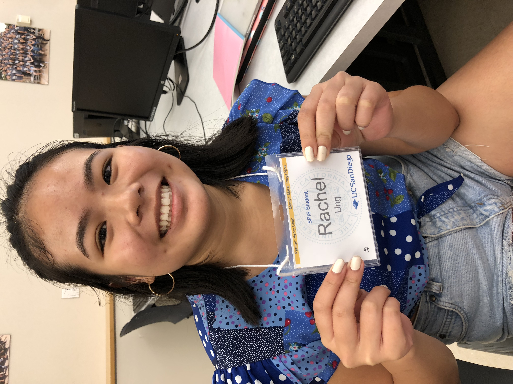

# ucsd-cse-spis-2018-practice-rachel-u

Hello, my name is Rachel Ung. I hope that during SPIS I can learn how to code and understand why people do it for fun. I come from a city called Los Alamitos; it's in northern Orange County, about an hour away from LA. Basically regurgitating my shpeel on the UCSD FB page, I'm a data science major in Eleanor Roosevelt College. In high school, I played tennis for three years, then my senior year, because I started working at Kumon as a math tutor. I was involved with my school's feminist club and ydsa chapter. 

